# nanoserver(客户端仅用于调试)

### 运行
Golang版本：go1.11
```
export GOPROXY=https://goproxy.io
```

**申明: 本代码开源的目的在于作为`Nano`的示例用于学习, 使用者的其他行为与作者无关**

- 微信群: 请扫描微信群二维码加入（如果群满，请添加群主拉群）

    
    
    
- ~~QQ**交流群(QQGroup): 289680347**(已满) [](http://shang.qq.com/wpa/qunwpa?idkey=24e06c02d306f6559528e8434b3b54ed049628fdba4c5dcbcfe9f0e2f611cf81)~~

四川麻将玩法, 血战到底(三人模式/四人模式)服务器程序,  房卡模式, 支持俱乐部.

基于[`Nano`](https://github.com/lonnng/nano)开发, 本程序主要用于演示如何使用`nano`进行游戏服务器程序开发, 演示客户端下载地址: 

- iOS: https://fir.im/tios
- Android: https://fir.im/tand
- Source Code: 微信群公告
- Prebuilt: 如果要连接自己的服务器
  + 简单模式: 使用PC客户端/Mac客户端(不支持微信登录, 只能使用游客登录, 客户端群文件共享)
  + 困难模式: 可以反编译android的包, 然后修改appConfig.lua中的远程服务器地址, 然后重新打包就可以玩了.

### 游戏截图

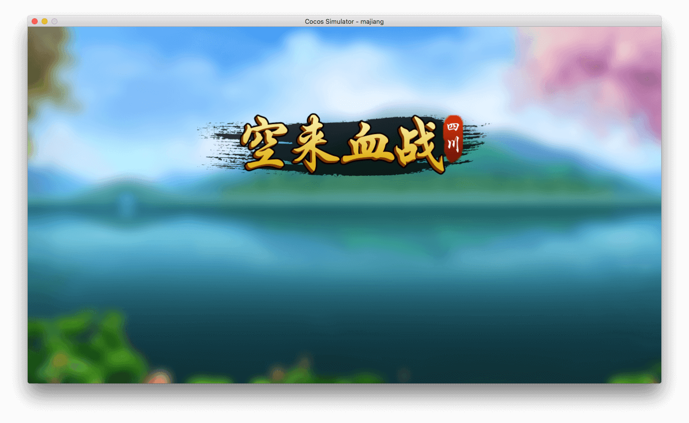

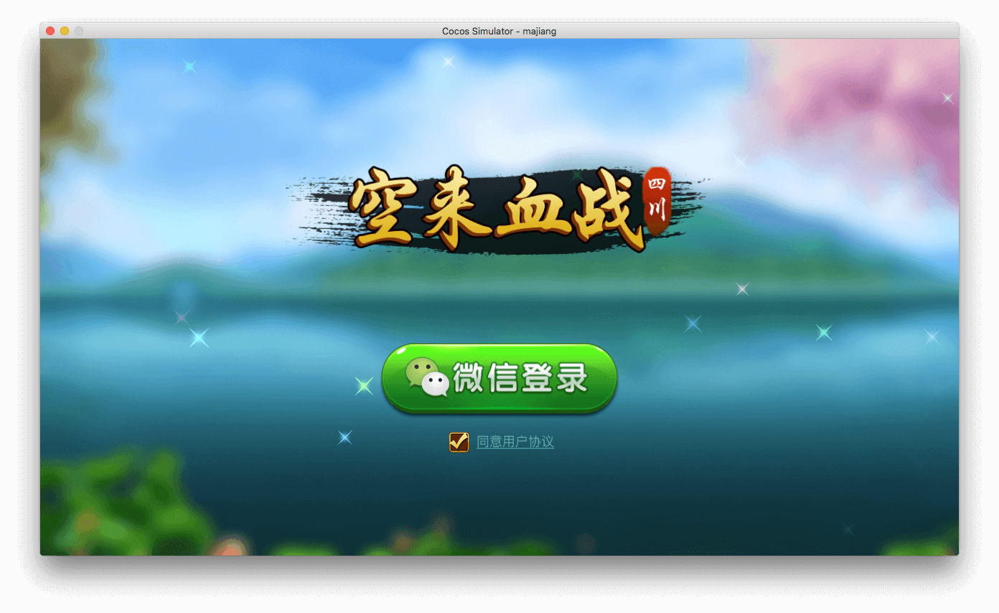

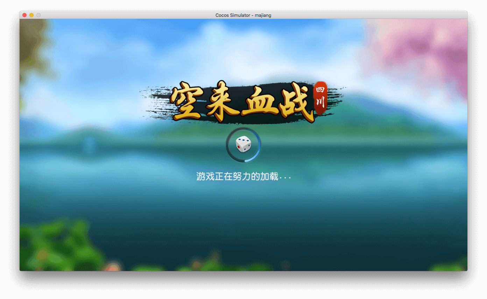


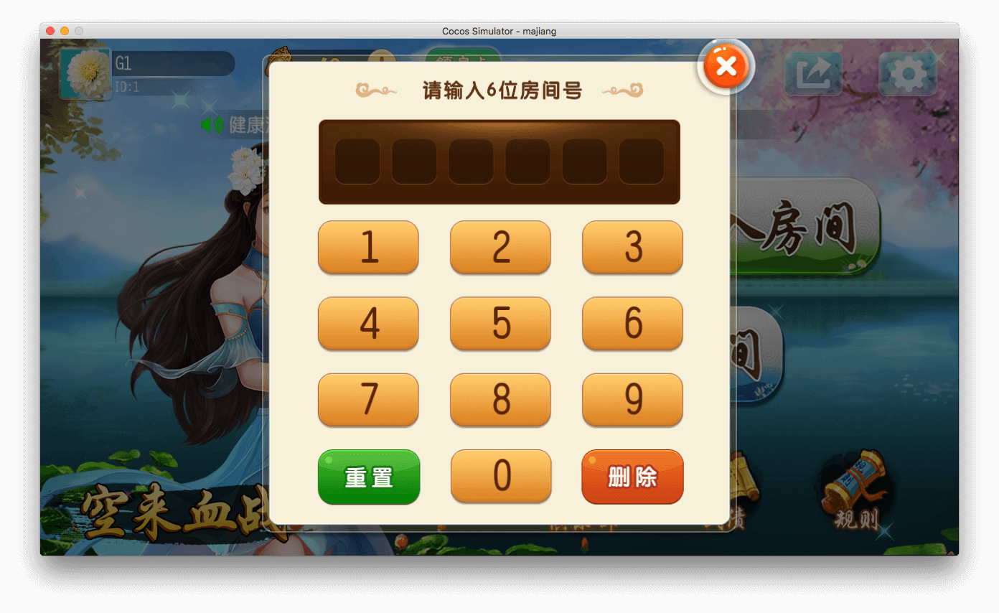

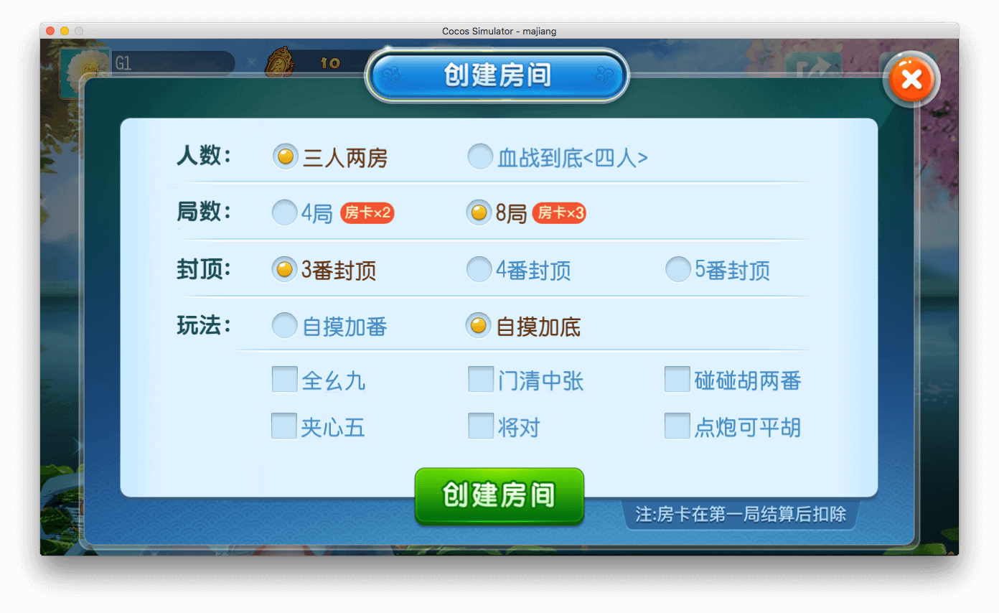

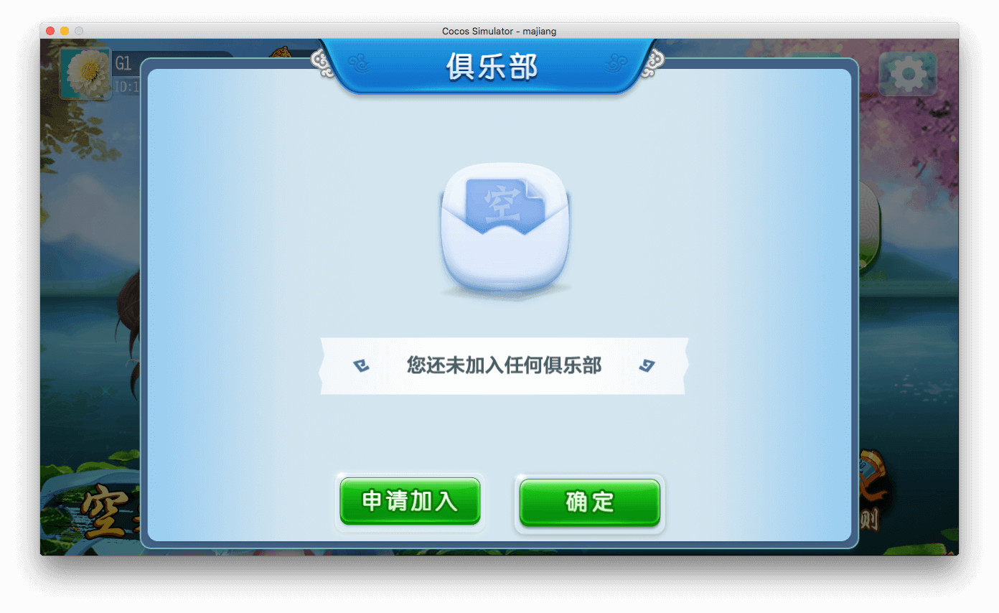

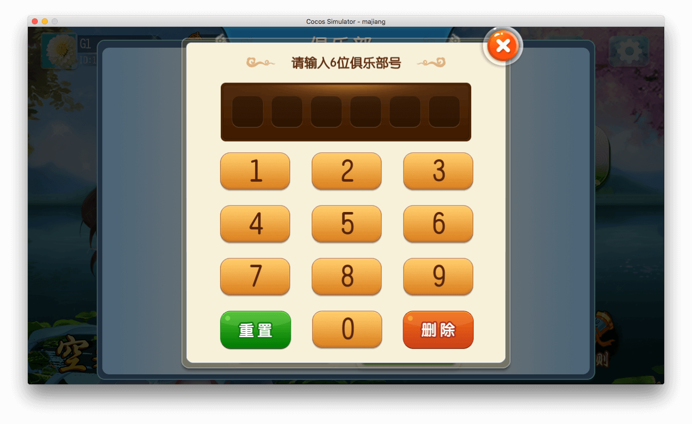


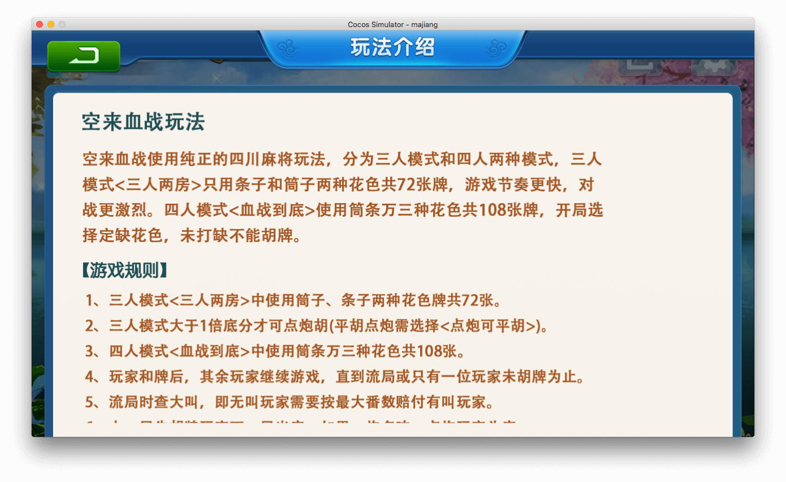

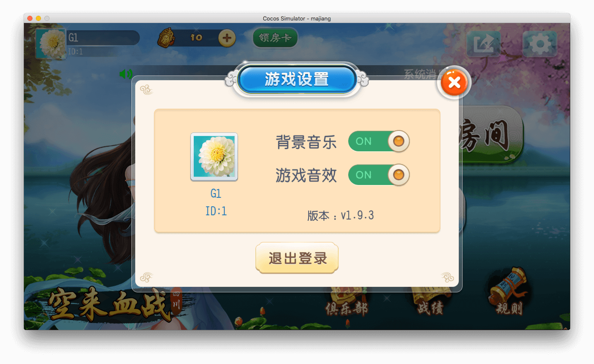

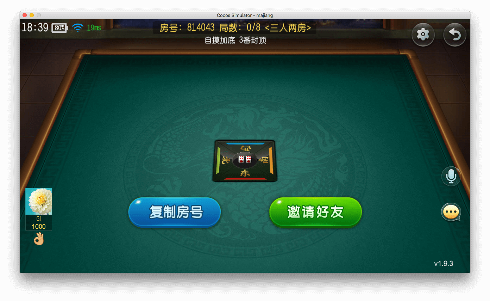

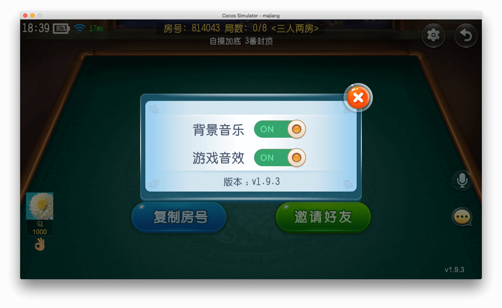

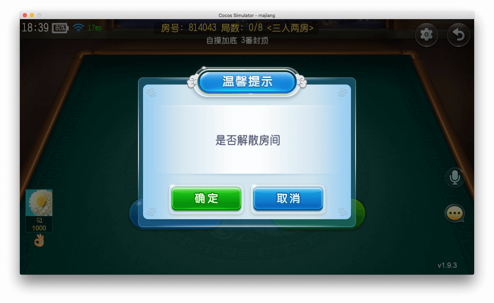

### 功能介绍

1. 首次运行自动创建MySQL数据库表结构
2. 结构化日志
3. 血战三人玩法/四人玩法完整实现
4. 微信登录/支付
5. 游客测试登录
6. 热更补丁下载(Web服务器模块)
7. 保存游戏记录,  回放支持
8. 房间整体流程(玩家开房/俱乐部开房/玩家邀请/解散房间)
9. 支持WebSocket(https://github.com/lonnng/nanoserver/blob/2018aaf60b55e182f466c733dce14d95c7533e74/cmd/mahjong/game/game.go#L83)
10. 断线重连(网络切换/强杀进程/手机异常关机)均可以恢复游戏状态.
11. ... ...

## `Nano`文档

- English
    + [How to build your first nano application](https://github.com/lonnng/nano/blob/master/docs/get_started.md)
    + [Route compression](https://github.com/lonnng/nano/blob/master/docs/route_compression.md)
    + [Communication protocol](https://github.com/lonnng/nano/blob/master/docs/communication_protocol.md)
    + [Design patterns](https://github.com/lonnng/nano/blob/master/docs/design_patterns.md)
    + [API Reference(Server)](https://godoc.org/github.com/lonnng/nano)

- 简体中文
    + [如何构建你的第一个nano应用](https://github.com/lonnng/nano/blob/master/docs/get_started_zh_CN.md)
    + [路由压缩](https://github.com/lonnng/nano/blob/master/docs/route_compression_zh_CN.md)
    + [通信协议](https://github.com/lonnng/nano/blob/master/docs/communication_protocol_zh_CN.md)
    + [API参考(服务器)](https://godoc.org/github.com/lonnng/nano)

## 配置

- 数据库配置
- 语音账号配置(如果有客户端)
- 微信登录和支付配置
- 端口配置

## 源码编译

```bash
git clone git@github.com:lonng/nanoserver.git
go run main.go
```

## LICENSE
MIT LICENSE
